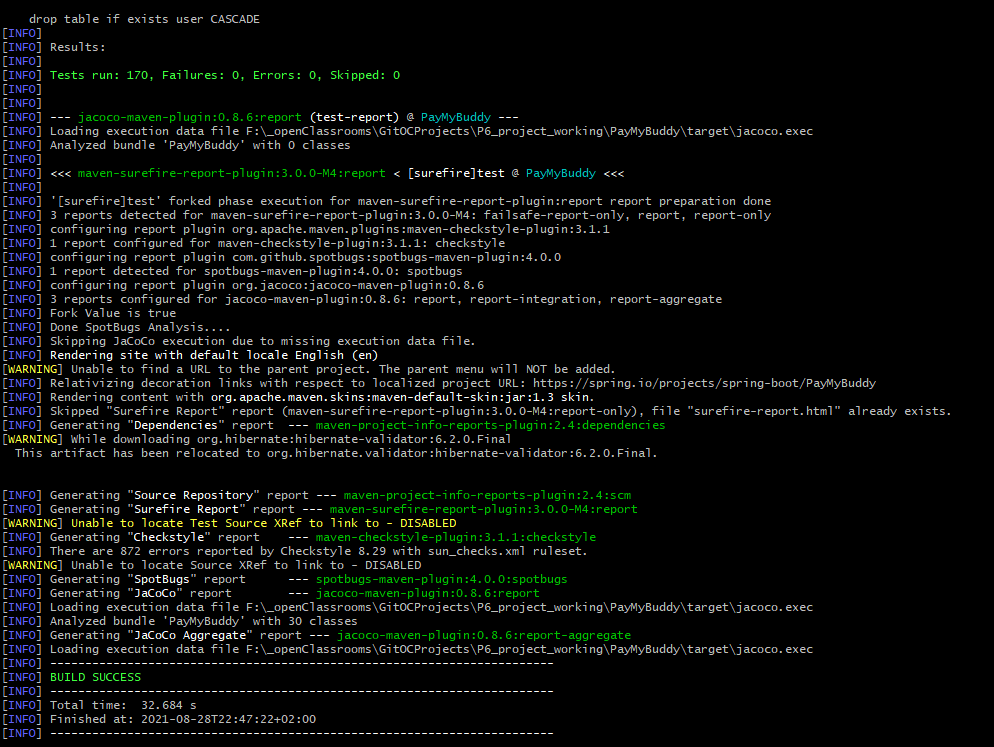
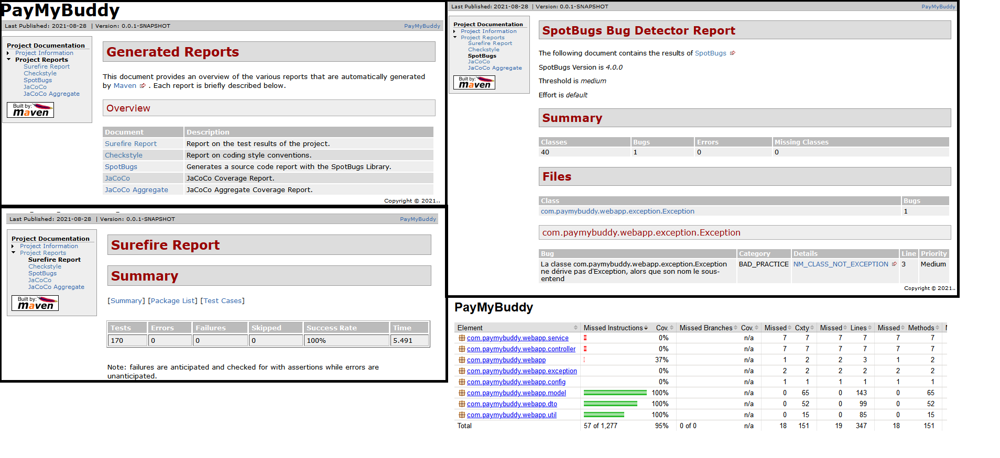
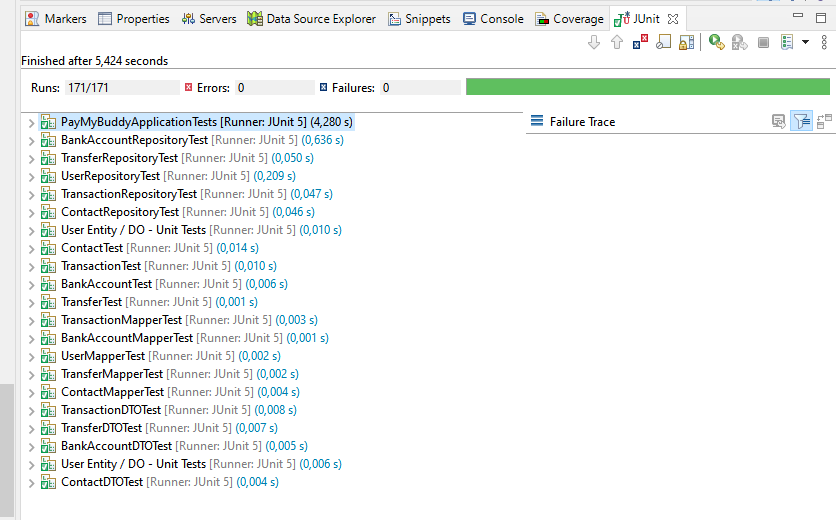
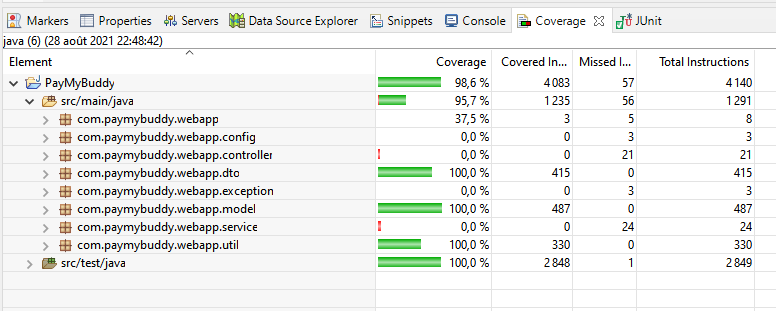

# Pay My Buddy - APPLICATION DEVELOPMENT  - PROGRESS TIMELINE REPORT

<b>PayMyBuddy</b> We make moving your money easy!

 The purpose of the project is to build an App that would allow customers to transfer money, to manage their finances or pay their friends with atmost ease. 

   * [DO Mapper DTO Units Tests Done](#do-mapper-dto-units-tests-done)

   

DO Mapper DTO Units Tests Done
===

DAL connection established with H2 Database and Units tests for DOs, Mappers, DTOs performed 

 
    

 
    

 
    

 
    
<b>// TODO === > </b> 

