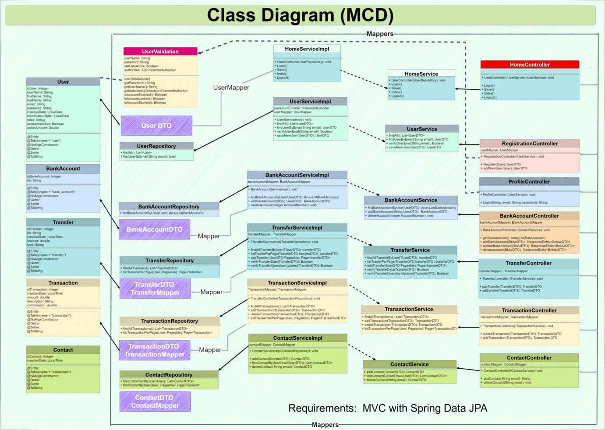

# Pay My Buddy

<b>PayMyBuddy</b> We make moving your money easy!

 The purpose of the project is to build an App that would allow customers to transfer money, to manage their finances or pay their friends with atmost ease. 

Introduction
===

The main goal is to commit on participating in the different phases of the software development cycle that involves: 
	(requirements definition - Functional & Technical requirements), 
	 (objectives, opportunities, constraints, resources, requirements, milestones ...), 
	 (WireFraming, User Stories, Data flow diagram - DFD, Technical Design - Software blueprint, UI prototyping, DDD principle ...), 
	 (Spring boot framework - backend API development), 
	 (Unit, Integration Testing... Code quality review, report generation, Test summary..), 
	 - pre-release evaluation with domain experts on its quality standards to deliver as a functionally strong backend Application API. 

Technical Specifications
===
Keeping in mind the obligations of the production environment, the following technologies are used: 
 
    

 

  

 

   

---

   

Project Milestones
===
[Milestones](readme_files/project_milestones.md "Project Milestones")🡸 

Preliminary Design Sketches
===

[Functional Scope](readme_files/DESIGN_DRAFTS.md "Functional Scope")🡸 

[Activity Diagram](readme_files/DESIGN_DRAFTS.md "Activity Diagram")🡸 

[User Case Diagram](readme_files/DESIGN_DRAFTS.md "User Case Diagram")🡸 

[Activity Diagram Elaborated Sketching](readme_files/DESIGN_DRAFTS.md "Activity Diagram Elaborated Sketching")🡸 

### Login View Template Mockup Sketch API Endpoints and Development Features Analysis

[Login Endpoint](readme_files/DESIGN_DRAFTS.md "Login Endpoint")🡸 

### SignUp View Template Mockup Sketch API Endpoints and Development Features Analysis

[SignUp Endpoint](readme_files/DESIGN_DRAFTS.md "SignUp Endpoint")🡸 

### Detailed features requirement Analysis on API endpoints and validation rules

[API endpoints and validation rules](readme_files/DESIGN_DRAFTS.md "API endpoints and validation rules")🡸 

Schema MVC Software Architecture Design
===

🡸 

UML class diagram MCD
===

🡸 

UML physical Data Model MPD Entity RelationShip Diagram ER
===

🡸 

SQL Scripts
===

[SQL Scripts](readme_files/sql_scripts.md "SQLScripts")🡸 

UI visuals
===

[USER INTERFACE VISUALS](readme_files/ui_visuals.md "USER INTERFACE VISUALS")🡸  

Endpoints Information
===

Actuator Info
===

[ACTUATOR ENDPOINTS](readme_files/actuator_info.md "ACTUATOR ENDPOINTS")🡸  

API Documentation Swagger
===

[SWAGGER API DOCUMENTATION](readme_files/swagger.md "SWAGGER API DOCUMENTATION")🡸  

### Authors

Mentee:🡆 @Senthil

Mentor:🡆 Clément SEZETTRE

### versions
Version:🡆 1.0

### License
@OpenClassrooms & @PayMyBuddy

Reference Documentation
===
For further reference, consider the following sections:

* [Official Apache Maven documentation](https://maven.apache.org/guides/index.html)
* [Spring Boot Maven Plugin Reference Guide](https://docs.spring.io/spring-boot/docs/2.5.4/maven-plugin/reference/html/)
* [Create an OCI image](https://docs.spring.io/spring-boot/docs/2.5.4/maven-plugin/reference/html/#build-image)
* [Spring Boot DevTools](https://docs.spring.io/spring-boot/docs/2.5.4/reference/htmlsingle/#using-boot-devtools)
* [Validation](https://docs.spring.io/spring-boot/docs/2.5.4/reference/htmlsingle/#boot-features-validation)
* [Spring Boot Actuator](https://docs.spring.io/spring-boot/docs/2.5.4/reference/htmlsingle/#production-ready)
* [Spring Data JPA](https://docs.spring.io/spring-boot/docs/2.5.4/reference/htmlsingle/#boot-features-jpa-and-spring-data)
* [Spring Security](https://docs.spring.io/spring-boot/docs/2.5.4/reference/htmlsingle/#boot-features-security)
* [Thymeleaf](https://docs.spring.io/spring-boot/docs/2.5.4/reference/htmlsingle/#boot-features-spring-mvc-template-engines)
* [Spring Web](https://docs.spring.io/spring-boot/docs/2.5.4/reference/htmlsingle/#boot-features-developing-web-applications)
* [STAN DOCUMENTATION WHITE PAPER](http://stan4j.com/papers/stan-whitepaper.pdf) 

Reference Guides
===
The following guides illustrate how to use some features concretely:

* [Building a RESTful Web Service with Spring Boot Actuator](https://spring.io/guides/gs/actuator-service/)
* [Accessing data with MySQL](https://spring.io/guides/gs/accessing-data-mysql/)
* [Accessing Data with JPA](https://spring.io/guides/gs/accessing-data-jpa/)
* [Securing a Web Application](https://spring.io/guides/gs/securing-web/)
* [Spring Boot and OAuth2](https://spring.io/guides/tutorials/spring-boot-oauth2/)
* [Authenticating a User with LDAP](https://spring.io/guides/gs/authenticating-ldap/)
* [Handling Form Submission](https://spring.io/guides/gs/handling-form-submission/)
* [Building a RESTful Web Service](https://spring.io/guides/gs/rest-service/)
* [Serving Web Content with Spring MVC](https://spring.io/guides/gs/serving-web-content/)
* [Building REST services with Spring](https://spring.io/guides/tutorials/bookmarks/)
* [STAN Structure Analysis for Java](http://stan4j.com/)
