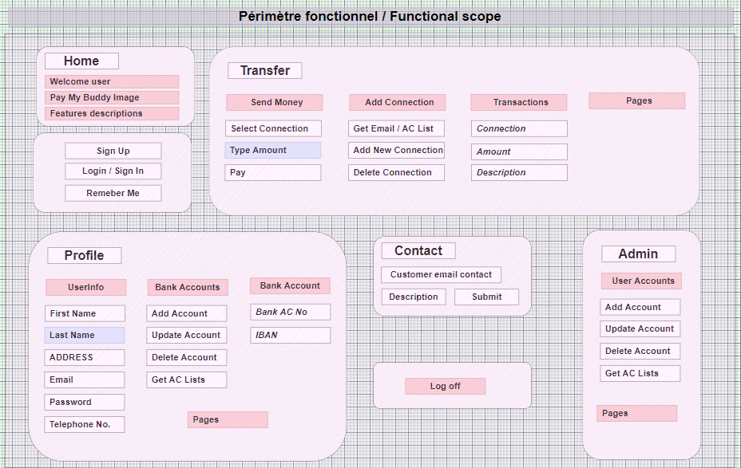
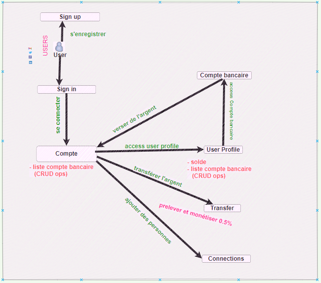
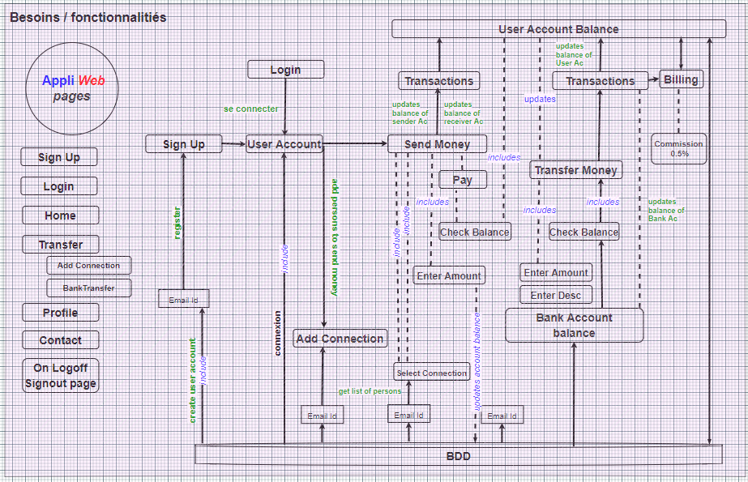
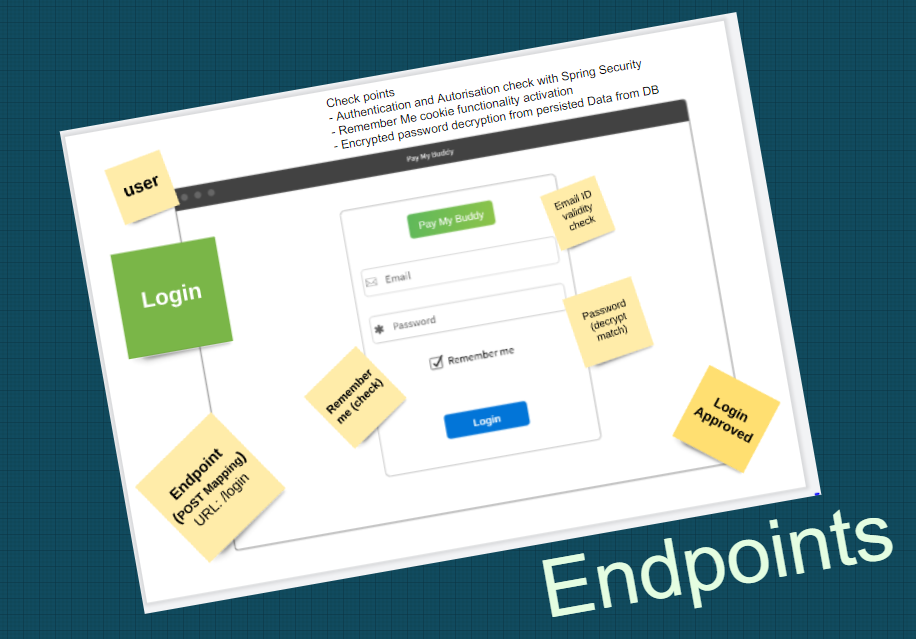

# Pay My Buddy

<b>PayMyBuddy</b> We make moving your money easy!

 The purpose of the project is to build an App that would allow customers to transfer money, to manage their finances or pay their friends with atmost ease. 

   * [Preliminary Design Sketches](#preliminary-design-sketches)
   * [Functional Scope of the Requirements](#functional-scope-of-the-requirements)
   * [Activity Diagram](#activity-diagram)
   * [User Case Diagram](#user-case-diagram)
   * [Activity Diagram Elaborated Sketching](#activity-diagram-elaborated-sketching)
   * [Login View Template Mockup Sketch API Endpoints and Development Features Analysis](#login-view-template-mockup-sketch-api-endpoints-and-development-features-analysis)
   * [SignUp View Template Mockup Sketch API Endpoints and Development Features Analysis](#signup-view-template-mockup-sketch-api-endpoints-and-development-features-analysis)
   * [Detailed features requirement Analysis on API endpoints and validation rules](#detailed-features-requirement-analysis-on-api-endpoints-and-validation-rules)

   * [Reference Documentation](#reference-documentation)
   * [Reference Guides](#reference-guides)
   

Preliminary Design Sketches
===
Functional Scope of the Requirements
===
 

Activity Diagram
===

 

User Case Diagram
===

 

Activity Diagram Elaborated Sketching
===

 

Login View Template Mockup Sketch API Endpoints and Development Features Analysis
===

 

SignUp View Template Mockup Sketch API Endpoints and Development Features Analysis
===

 

Detailed features requirement Analysis on API endpoints and validation rules
===

 

Reference Documentation
===
For further reference, consider the following sections:

* [Official Apache Maven documentation](https://maven.apache.org/guides/index.html)
* [Spring Boot Maven Plugin Reference Guide](https://docs.spring.io/spring-boot/docs/2.5.4/maven-plugin/reference/html/)
* [Create an OCI image](https://docs.spring.io/spring-boot/docs/2.5.4/maven-plugin/reference/html/#build-image)
* [Spring Boot DevTools](https://docs.spring.io/spring-boot/docs/2.5.4/reference/htmlsingle/#using-boot-devtools)
* [Validation](https://docs.spring.io/spring-boot/docs/2.5.4/reference/htmlsingle/#boot-features-validation)
* [Spring Boot Actuator](https://docs.spring.io/spring-boot/docs/2.5.4/reference/htmlsingle/#production-ready)
* [Spring Data JPA](https://docs.spring.io/spring-boot/docs/2.5.4/reference/htmlsingle/#boot-features-jpa-and-spring-data)
* [Spring Security](https://docs.spring.io/spring-boot/docs/2.5.4/reference/htmlsingle/#boot-features-security)
* [Thymeleaf](https://docs.spring.io/spring-boot/docs/2.5.4/reference/htmlsingle/#boot-features-spring-mvc-template-engines)
* [Spring Web](https://docs.spring.io/spring-boot/docs/2.5.4/reference/htmlsingle/#boot-features-developing-web-applications)

Reference Guides
===
The following guides illustrate how to use some features concretely:

* [Building a RESTful Web Service with Spring Boot Actuator](https://spring.io/guides/gs/actuator-service/)
* [Accessing data with MySQL](https://spring.io/guides/gs/accessing-data-mysql/)
* [Accessing Data with JPA](https://spring.io/guides/gs/accessing-data-jpa/)
* [Securing a Web Application](https://spring.io/guides/gs/securing-web/)
* [Spring Boot and OAuth2](https://spring.io/guides/tutorials/spring-boot-oauth2/)
* [Authenticating a User with LDAP](https://spring.io/guides/gs/authenticating-ldap/)
* [Handling Form Submission](https://spring.io/guides/gs/handling-form-submission/)
* [Building a RESTful Web Service](https://spring.io/guides/gs/rest-service/)
* [Serving Web Content with Spring MVC](https://spring.io/guides/gs/serving-web-content/)
* [Building REST services with Spring](https://spring.io/guides/tutorials/bookmarks/)

