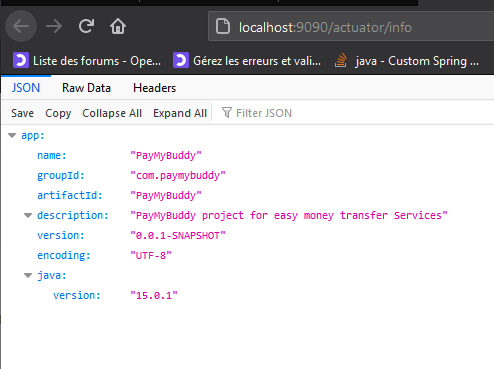

# Pay My Buddy - APPLICATION DEVELOPMENT  - ACTUATOR

<b>PayMyBuddy</b> We make moving your money easy!

 The purpose of the project is to build an App that would allow customers to transfer money, to manage their finances or pay their friends with atmost ease. 

    

Actuator Info
===

#### <i> ACTUATOR MAIN ENPOINT </i>
---

   

  

#### <i> ACTUATOR INFO ENPOINT </i>
---

   

  

#### <i> ACTUATOR HEALTH ENPOINT </i>
---

   

  

#### <i> ACTUATOR HTTPTRACE ENPOINT </i>
---

   

  

#### <i> ACTUATOR METRICS ENPOINT </i>
---

   

  

#### <i> ACTUATOR PROCCESS UPTIME ENPOINT </i>
---

   

  

