# Pay My Buddy - APPLICATION DEVELOPMENT  - STAN - STRUCTURAL ANALYSIS - DESIGN METRICS

<b>PayMyBuddy</b> We make moving your money easy!

 The purpose of the project is to build an App that would allow customers to transfer money, to manage their finances or pay their friends with atmost ease. 

    

STAN - STRUCTURAL ANALYSIS - DESIGN METRICS
===

#### <i> DESIGN METRICS - PACKAGES </i>
---

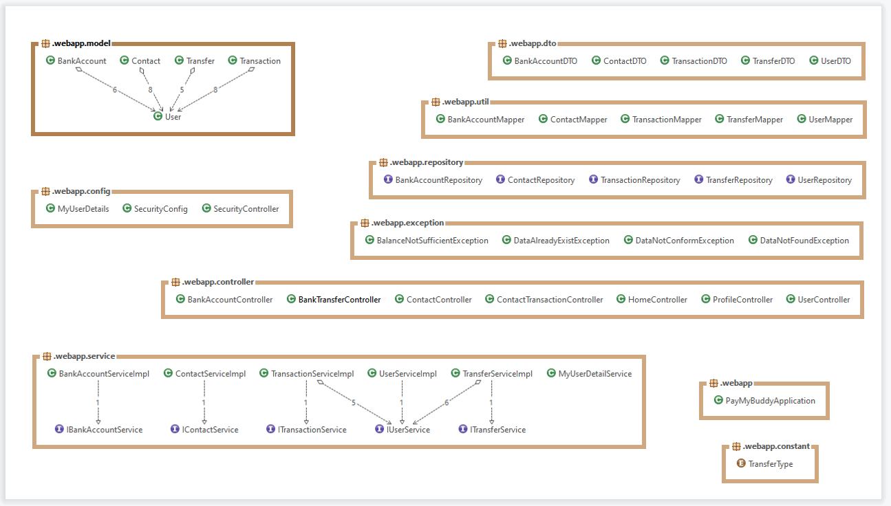   

  

#### <i> DESIGN METRICS - CODE BLOCKS </i>
---

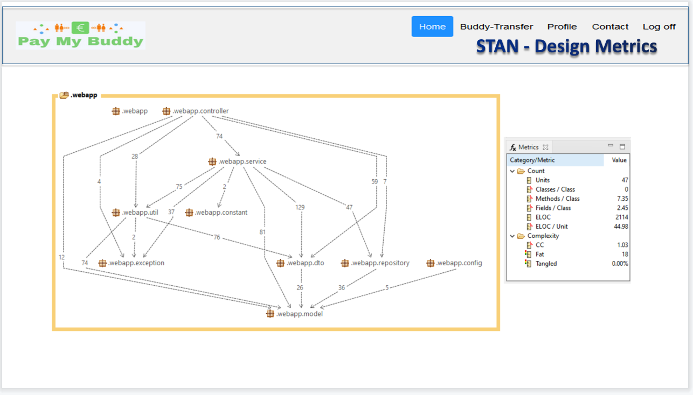   

  

#### <i> DESIGN METRICS -CONTROLLERS FLOWLINE </i>
---

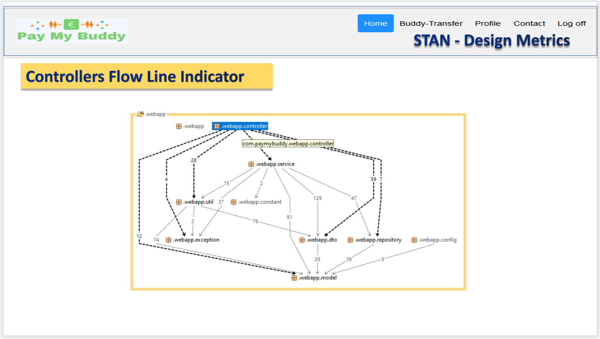   

  

#### <i> DESIGN METRICS - DTOS FLOWLINE </i>
---

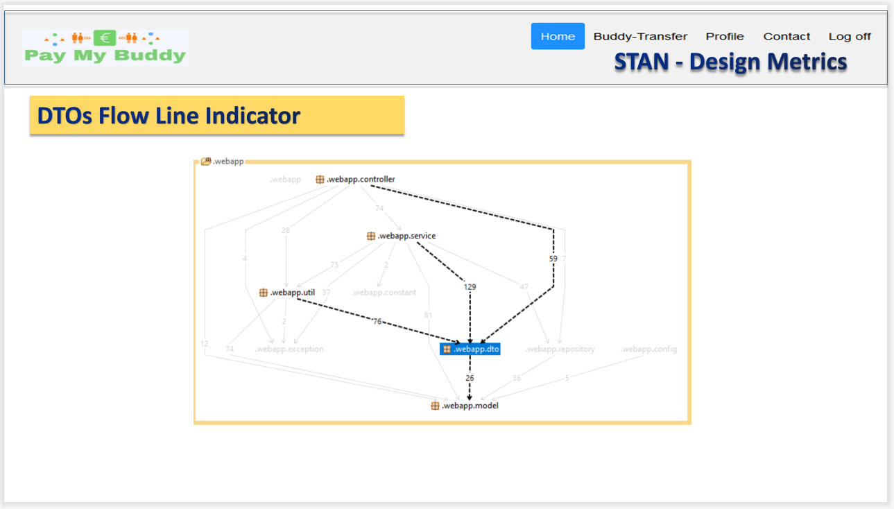   

  

#### <i> DESIGN METRICS - SERVICES FLOWLINE </i>
---

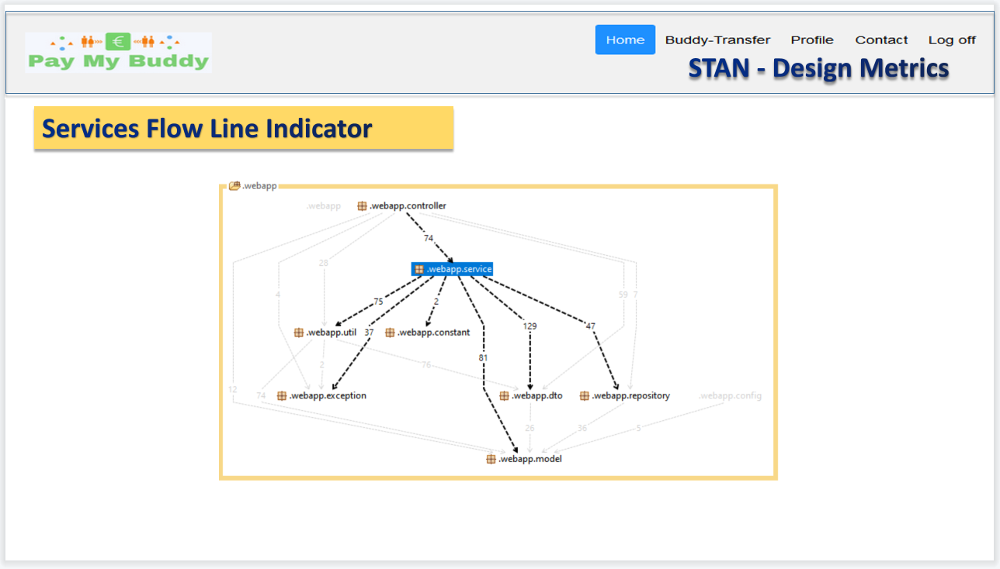   

  

#### <i> DESIGN METRICS - REPOSITORIES FLOWLINE </i>
---

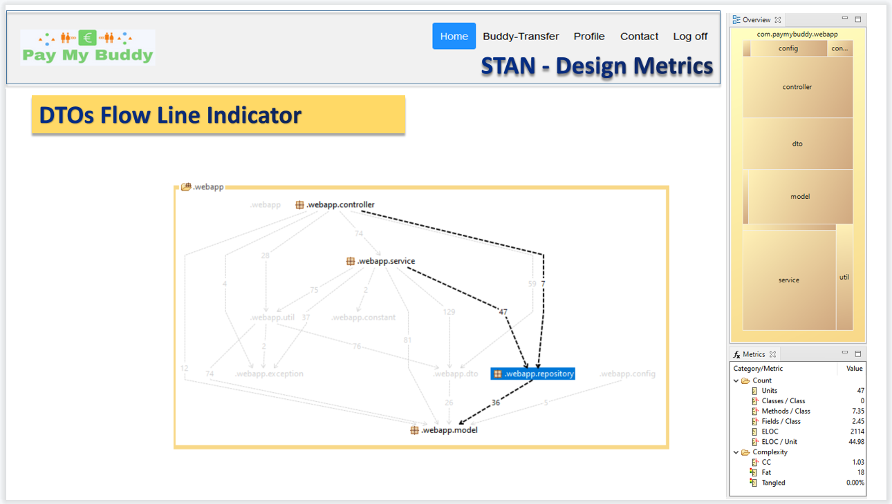   

  

#### <i> DESIGN METRICS - SECURITY CONCERNS </i>
---

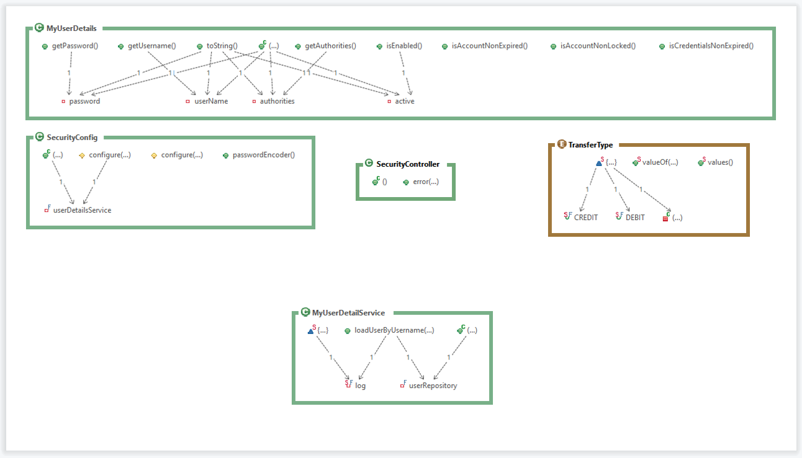   

  

#### <i> DESIGN METRICS - CONTROLLERS </i>
---

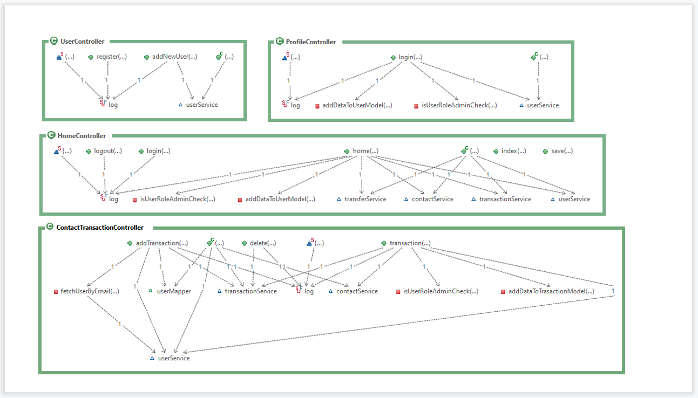   

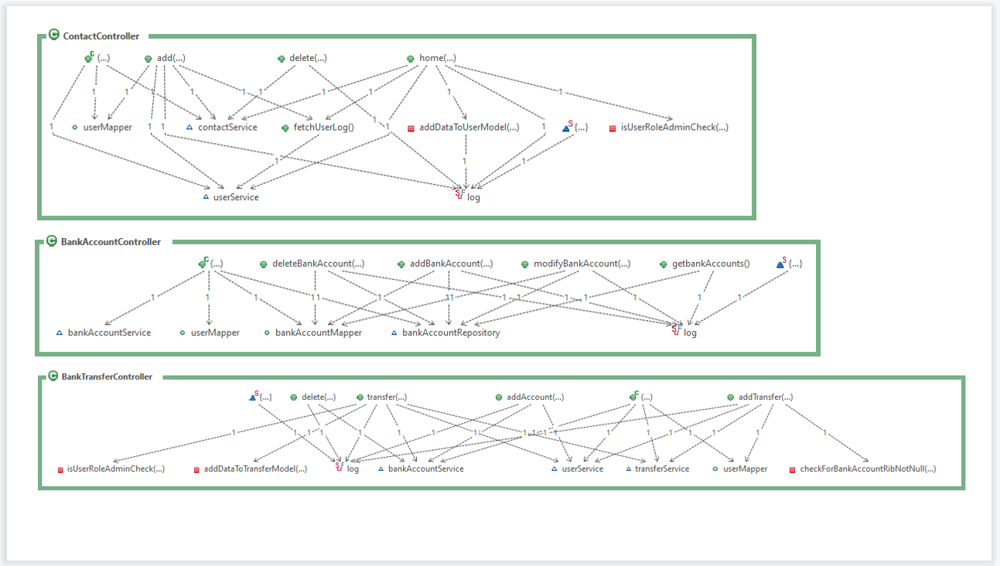   

  

#### <i> DESIGN METRICS - SERVICES </i>
---

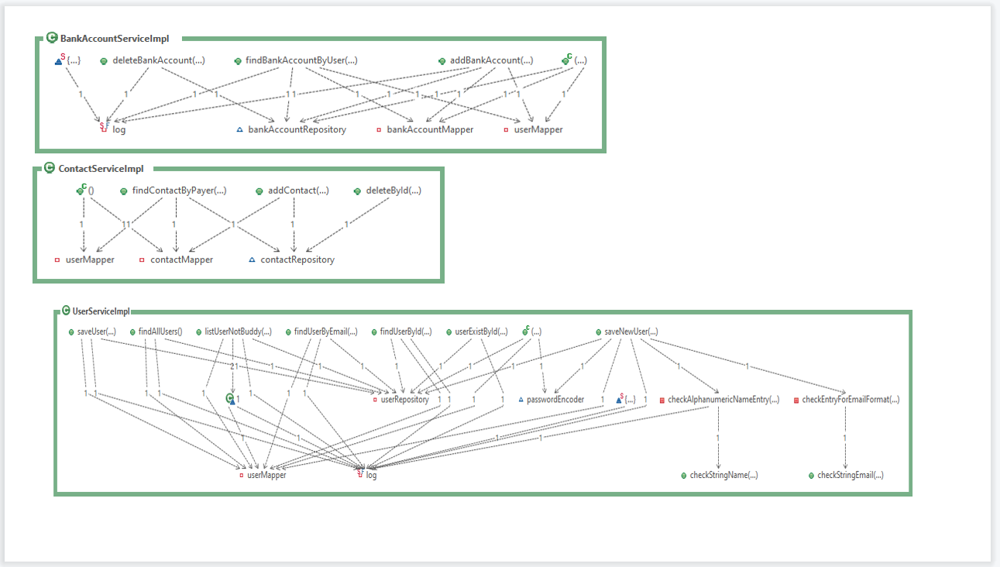   

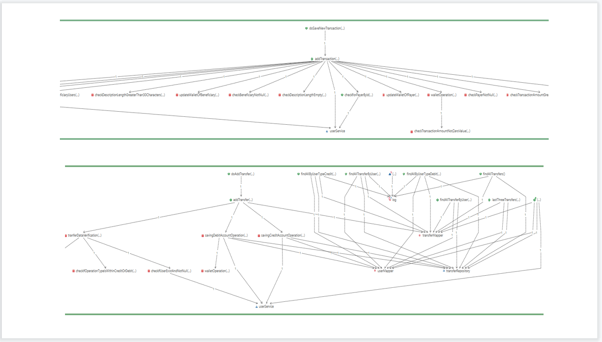   

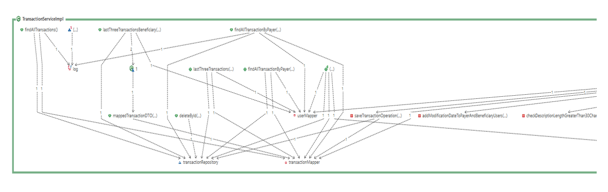   

  

Reference Documentation
===
For further reference, consider the following sections:

* [STAN DOCUMENTATION WHITE PAPER](http://stan4j.com/papers/stan-whitepaper.pdf) 
* [Official Apache Maven documentation](https://maven.apache.org/guides/index.html)
* [Spring Boot Maven Plugin Reference Guide](https://docs.spring.io/spring-boot/docs/2.5.4/maven-plugin/reference/html/)
* [Create an OCI image](https://docs.spring.io/spring-boot/docs/2.5.4/maven-plugin/reference/html/#build-image)
* [Spring Boot DevTools](https://docs.spring.io/spring-boot/docs/2.5.4/reference/htmlsingle/#using-boot-devtools)
* [Validation](https://docs.spring.io/spring-boot/docs/2.5.4/reference/htmlsingle/#boot-features-validation)
* [Spring Boot Actuator](https://docs.spring.io/spring-boot/docs/2.5.4/reference/htmlsingle/#production-ready)
* [Spring Data JPA](https://docs.spring.io/spring-boot/docs/2.5.4/reference/htmlsingle/#boot-features-jpa-and-spring-data)
* [Spring Security](https://docs.spring.io/spring-boot/docs/2.5.4/reference/htmlsingle/#boot-features-security)
* [Thymeleaf](https://docs.spring.io/spring-boot/docs/2.5.4/reference/htmlsingle/#boot-features-spring-mvc-template-engines)
* [Spring Web](https://docs.spring.io/spring-boot/docs/2.5.4/reference/htmlsingle/#boot-features-developing-web-applications)

Reference Guides
===
The following guides illustrate how to use some features concretely:

* [STAN Structure Analysis for Java](http://stan4j.com/)
* [Building a RESTful Web Service with Spring Boot Actuator](https://spring.io/guides/gs/actuator-service/)
* [Accessing data with MySQL](https://spring.io/guides/gs/accessing-data-mysql/)
* [Accessing Data with JPA](https://spring.io/guides/gs/accessing-data-jpa/)
* [Securing a Web Application](https://spring.io/guides/gs/securing-web/)
* [Spring Boot and OAuth2](https://spring.io/guides/tutorials/spring-boot-oauth2/)
* [Authenticating a User with LDAP](https://spring.io/guides/gs/authenticating-ldap/)
* [Handling Form Submission](https://spring.io/guides/gs/handling-form-submission/)
* [Building a RESTful Web Service](https://spring.io/guides/gs/rest-service/)
* [Serving Web Content with Spring MVC](https://spring.io/guides/gs/serving-web-content/)
* [Building REST services with Spring](https://spring.io/guides/tutorials/bookmarks/)

