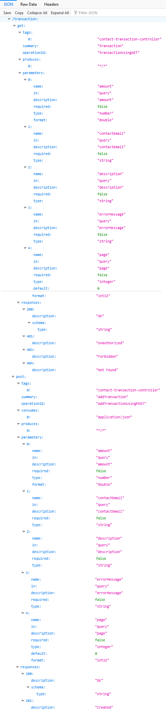

# Pay My Buddy - APPLICATION DEVELOPMENT  - SWAGGER API DOCUMENTATION

<b>PayMyBuddy</b> We make moving your money easy!

 The purpose of the project is to build an App that would allow customers to transfer money, to manage their finances or pay their friends with atmost ease. 

    

SWAGGER API DOCUMENTATION Info
===

#### <i> SWAGGER API DOCUMENTATION </i>
---

   

  

#### <i> SWAGGER API DOCUMENTATION - PATHS </i>
---

   

  

#### <i> SWAGGER API DOCUMENTATION - REGISTER </i>
---

   

  

#### <i> SWAGGER API DOCUMENTATION - PROFILE </i>
---

   

  

#### <i> SWAGGER API DOCUMENTATION - HOME </i>
---

   

  

#### <i> SWAGGER API DOCUMENTATION - INDEX </i>
---

   

  

#### <i> SWAGGER API DOCUMENTATION - LOGIN </i>
---

   

  

#### <i> SWAGGER API DOCUMENTATION - LOGOUT </i>
---

   

  

#### <i> SWAGGER API DOCUMENTATION - TRANSACTION </i>
---

   

  

#### <i> SWAGGER API DOCUMENTATION - TRANSFER </i>
---

   

  

#### <i> SWAGGER API DOCUMENTATION - GET CONTACT </i>
---

   

  

#### <i> SWAGGER API DOCUMENTATION - ADD CONTACT </i>
---

   

  

#### <i> SWAGGER API DOCUMENTATION - DELETE CONTACT </i>
---

   

  

#### <i> SWAGGER API DOCUMENTATION - ADD TRANSFER </i>
---

   

  

#### <i> SWAGGER API DOCUMENTATION - DELETE TRANSACTION </i>
---

   

  

#### <i> SWAGGER API DOCUMENTATION - ERROR </i>
---

   

  

#### <i> SWAGGER API DOCUMENTATION -ADD BANK ACCOUNT </i>
---

   

  

#### <i> SWAGGER API DOCUMENTATION - DELETE ACCOUNT </i>
---

   

  

#### <i> SWAGGER API DOCUMENTATION - MANAGE BANK ACCOUNTS </i>
---

   

  

#### <i> SWAGGER API DOCUMENTATION - MANAGE BANK ACCOUNT </i>
---

   

  

#### <i> SWAGGER API DOCUMENTATION - NON AUTHORIZED </i>
---

   

  

#### <i> SWAGGER API DOCUMENTATION - BANK ACCOUNT POST EXAMPLE </i>
---

   

  

#### <i> SWAGGER API DOCUMENTATION - SAVE </i>
---

   

  

#### <i> SWAGGER API DOCUMENTATION - UI INDEX </i>
---

   

  

Reference Documentation - SPRING BOOT - DATA JPA - SPRING SECURITY
===
For further reference, consider the following sections:

* [Official Apache Maven documentation](https://maven.apache.org/guides/index.html)
* [Spring Boot Maven Plugin Reference Guide](https://docs.spring.io/spring-boot/docs/2.5.4/maven-plugin/reference/html/)
* [Create an OCI image](https://docs.spring.io/spring-boot/docs/2.5.4/maven-plugin/reference/html/#build-image)
* [Spring Boot DevTools](https://docs.spring.io/spring-boot/docs/2.5.4/reference/htmlsingle/#using-boot-devtools)
* [Validation](https://docs.spring.io/spring-boot/docs/2.5.4/reference/htmlsingle/#boot-features-validation)
* [Spring Boot Actuator](https://docs.spring.io/spring-boot/docs/2.5.4/reference/htmlsingle/#production-ready)
* [Spring Data JPA](https://docs.spring.io/spring-boot/docs/2.5.4/reference/htmlsingle/#boot-features-jpa-and-spring-data)
* [Spring Security](https://docs.spring.io/spring-boot/docs/2.5.4/reference/htmlsingle/#boot-features-security)
* [Thymeleaf](https://docs.spring.io/spring-boot/docs/2.5.4/reference/htmlsingle/#boot-features-spring-mvc-template-engines)
* [Spring Web](https://docs.spring.io/spring-boot/docs/2.5.4/reference/htmlsingle/#boot-features-developing-web-applications)

Reference Guides
===
The following guides illustrate how to use some features concretely:

* [Building a RESTful Web Service with Spring Boot Actuator](https://spring.io/guides/gs/actuator-service/)
* [Accessing data with MySQL](https://spring.io/guides/gs/accessing-data-mysql/)
* [Accessing Data with JPA](https://spring.io/guides/gs/accessing-data-jpa/)
* [Securing a Web Application](https://spring.io/guides/gs/securing-web/)
* [Spring Boot and OAuth2](https://spring.io/guides/tutorials/spring-boot-oauth2/)
* [Authenticating a User with LDAP](https://spring.io/guides/gs/authenticating-ldap/)
* [Handling Form Submission](https://spring.io/guides/gs/handling-form-submission/)
* [Building a RESTful Web Service](https://spring.io/guides/gs/rest-service/)
* [Serving Web Content with Spring MVC](https://spring.io/guides/gs/serving-web-content/)
* [Building REST services with Spring](https://spring.io/guides/tutorials/bookmarks/)
